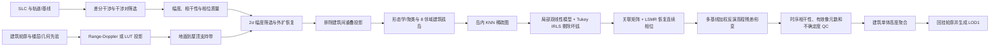

# `zjc` 文献、代码与同济区域复现深度研读报告

> 编制日期：2026-08-22  
> 研究目录：`/home/u/geocoding/tongji_sbas/zjc`  
> 复现目录：`/home/u/geocoding/tongji_sbas`  
> 文档性质：文献解释、代码审计、版本辨析与复现设计；不是对现有结果精度的外部真值认证。

## 1. 结论先行

1. `zjc` 方法的核心不是普通的“先全图解缠、再裁建筑”，而是让建筑轮廓在 InSAR 处理前端参与：建筑投影 → 建筑孤岛 → 岛内局部图解缠 → 多基线高程残差反演 → 单体高度聚合。
2. 两份文献和 MATLAB 代码不是同一版本。学位论文采用 **IQR 剔除后取中位数**；英文稿采用 **质量筛选后取最高像元**；MATLAB 多处采用 **max-min**。三者不可混称为同一估计量。
3. `zjc/my_study` 是研究原型和试验集合，不是可直接迁移的端到端软件。它包含 85 个 `.m` 文件，其中有第三方解缠代码、重复副本、临时脚本、硬编码天津参数以及若干确定性缺陷。
4. 与论文最接近的 MATLAB 核心是 `unwrap_phase_matrix.m`：局部双线性相位模型、稳健回归剔除错误弧、稀疏关联矩阵和 LSMR 积分。但其 K 值、质量筛选、背景像元处理等仍与英文稿不完全一致。
5. 同济工程已经具备比 MATLAB 原型更完整的参数化 Python 主线：clean-ID 建筑、SAR 屋顶 mask、建筑孤岛、paper-like 解缠、SBAS/LGR 反演和严格 QC。复现应在这条 Python 主线上补齐论文缺口，而不应逐行移植 MATLAB。
6. 当前正式主线为 `cleanid_redshift_audited`：1028 栋中严格解算 239 栋，789 栋保持无解；`height` 字段不得参与拟合、筛选、标定、填补或 QC。
7. 若目标是“严格复现英文稿”，还需补齐：楼层先验支持带、2σ 幅度剔除与 3 像元外扩恢复、建筑投影重叠排除、`K=16` 图、明确的 Tukey/MAD IRLS、CRLB/相干性权重、时序相干性 `τ≥0.6`、理论不确定度 `≤5 m` 和最高合格像元聚合。

## 2. 证据范围与可追溯性

本报告只把项目内可验证材料作为一手证据，没有把互联网二手资料混入方法判定。

| 材料 | 定位 | 校验信息 |
|---|---|---|
| `zjc/Footprint-Constrained InSAR Phase Partitioning for High-Rise Building Height Inversion-with figures.pdf` | 较新的英文方法稿，12 页 | SHA-256 `a819a7479e599f9ed025e8ce3636d32933495468fb5d9129861cf2e67a15d8a8` |
| `zjc/融合InSAR与建筑物轮廓矢量的城市三维重建.pdf` | 2026 年 5 月硕士论文，83 页 | SHA-256 `9cabe69daaf787556195f661d7ccb949d2d616fd208ba55bf2702aca0d3d9807` |
| `zjc/my_study/` | MATLAB 研究原型，85 个 `.m` 文件 | 本报告逐文件归类 |
| `agent.md` | 当前工程状态入口 | 已在 2026-08-22 增加本报告入口；其中 active 结果沿用 2026-07 主线 |
| `docs/current_literature_route_and_optimization_plan.md` | 同济路线、历史试验和分支决策 | 最近标记为 2026-07-07 |
| `code/reproduce_tongji/README.md` | 当前 Python 主线的可执行命令 | 与 active 产品对应 |

阅读原则：英文稿作为最新算法规格；学位论文用于补充推导、阈值和实现背景；MATLAB 只证明“曾经怎样试验”，不能反向覆盖论文中的正式定义。

## 3. 科学问题与方法动机

高层建筑会在雷达坐标中形成强烈的高程不连续、叠掩和几何投影偏移。传统全场相位解缠默认邻近像元相位较连续，一旦在建筑—地面边界发生整周错误，错误可能沿全局网络传播。该方法把矢量建筑轮廓投到雷达坐标，并把每栋或每个连通组件作为独立相位域，目的是切断跨建筑边界的错误传播。

对第 `i` 个干涉对、像元 `p`，可将差分相位抽象为：

```text
φ_i(p) = a_i · Δh(p) + b_i · v(p) + φ_atm,i(p) + φ_noise,i(p) + 2πk_i(p)
```

其中：

- `Δh` 是相对参考 DEM/DSM 的高程残差；
- `v` 是平均形变速率或相应时序参数；
- `a_i` 主要由垂直基线、波长、斜距和入射角决定；
- `b_i` 由时间基线决定；
- `k_i` 是必须由解缠恢复的整周数。

忽略符号约定时，高程相位灵敏度的量级关系为：

```text
∂φ/∂h ∝ B_perp / (λ · R · sinθ)
```

因此垂直基线跨度越大，高程可观测性通常越好；但实际符号取决于主从影像顺序、基线定义、干涉相位约定和 GAMMA 产品定义。代码中出现多种负号处理，复现时必须用模拟相位或已知控制点做符号单元测试，不能凭公式外观判断。

## 4. 文献中的完整算法链



### 4.1 干涉对与基础质量筛选

- 英文稿试验：21 景复城一号 C 波段 SLC，2023-02 至 2024-06，共构造 48 个干涉对，并要求垂直基线大于 30 m。
- 学位论文给出的选择区间更完整：垂直基线约 30–250 m、时间基线不超过 44 天，每栋建筑至少需要 12 个有效干涉对。
- 学位论文使用幅度离差 `DA≤0.4`、相干性 `γ≥0.75` 作为稳定像元门限。

这些参数属于对应数据集的实验设置，不应在同济区域未经敏感性分析直接当成普适常数。

### 4.2 建筑轮廓投影和候选支持区

论文目标是通过 Range-Doppler/二维查找表将地理坐标中的建筑轮廓映射到 SAR 雷达坐标。英文稿使用约 3 m 的层高把楼层信息转换为几何高度先验，用于构造从地面投影位置到屋顶投影位置之间的完整支持带。

关键边界：楼层或先验高度只用于扩大“去哪里找屋顶散射”的搜索支持，不应作为最终高度拟合真值、标定量或缺失值填充值。

### 4.3 幅度细化、重叠排除和建筑孤岛

英文稿描述的候选像元细化为：

1. 在支持区内部计算幅度统计，拒绝偏离掩膜均值超过 `2σ` 的像元；
2. 对外侧约 3 像元缓冲区中的幅度一致候选进行恢复；
3. 两栋建筑投影支持区重叠时，从双方候选中同时排除重叠部分，避免归属污染；
4. 通过膨胀与 8 邻域连通组件形成独立建筑孤岛。

学位论文还描述了形态学开运算和 DBSCAN，典型参数为 `eps=2.5` 像元、`MinPts=20`。当前 MATLAB 主执行链并未完整实现真正的 DBSCAN，主要依赖连通域/BFS 风格的标签逻辑。

### 4.4 岛内局部图解缠

对每个孤岛构建 KNN 稀疏图。英文稿给出 `K=16`，而 MATLAB 原型中可见 `N_nearest=9`、`N_knn=4` 等不同试验值。

局部模型以像元邻域内的坐标、幅度/相位特征拟合相邻节点的相位差。实现核心是双线性局部代理和 Tukey/Bisquare 稳健回归：

1. 对图上边估计连续相位差候选；
2. 用稳健回归降低离群弧影响；
3. 依据残差尺度剔除疑似整周污染的弧；
4. 将保留弧写入稀疏节点—边关联矩阵 `A`；
5. 用 LSMR 求解 `Aφ≈d`，并固定一个参考节点消除整体常数不唯一性。

该步骤只解决每个干涉图空间维度上的相位连续性，不等同于后续多干涉对的高程反演。

### 4.5 多基线高程残差反演

学位论文的 LGR/SBAS 形式同时使用垂直基线和时间基线，联合估计 DEM 残差及平均形变。每像元应至少满足有效干涉对数、垂直基线跨度和模型残差门限。

英文稿进一步强调按相干性、基线几何或理论方差进行加权，可理解为让高相干、高高程灵敏度的观测贡献更大。当前同济实现已有基线跨度、有效对数和 RMSE 门控，但尚不能等同于完整的 CRLB 加权实现。

### 4.6 像元 QC 与建筑高度聚合

这里存在最重要的版本分歧：

| 版本 | 像元/建筑聚合定义 | 备注 |
|---|---|---|
| 学位论文 | IQR 区间剔除离群值后取中位数 | 稳健，但会压低尖顶或只占少数像元的真实屋顶顶部 |
| 英文稿 | `τ<0.6` 像元剔除；合格像元中取最大高程改正，并加参考 DEM 均值 | 贴近“最高建筑点”，但对残留高值异常更敏感 |
| MATLAB 多处脚本 | `max-min` 或局部最大差 | 常是可视化/实验量，不是论文最终定义 |
| 同济当前主线 | 从最高点向下做单侧 Grubbs，得到 `top_down_grubbs` | 工程优化量，不是英文稿原样算法 |
| 同济候选 | `descending_grubbs_p95_floor` | 用于修正顶部过度剔除，尚非原论文定义 |

英文稿还规定：少于 15 个有效像元，或屋顶理论不确定度超过 5 m，应标为不可靠。严格复现时必须同时输出“论文原样聚合”和“工程稳健聚合”，不能只输出一个结果后称其为论文复现。

## 5. 文献试验结论及其适用边界

英文稿针对 79 栋 30 层以上高层建筑报告：每个孤岛约 2000–16800 像元；10 核环境总耗时约 40 分钟，而对照 MCF 约 3 小时；高度验证 `R²=0.984`、`RMSE=7.30 m`、`MAE=5.27 m`，残差均值 2.34 m、标准差 6.91 m，绝对误差 P50/P75/P90 分别为 3.27/6.89/12.84 m。

学位论文对 74 个未筛选干涉对的对照指出：MCF 有 30 对发生建筑高度反转，正确率 59.5%；提出方法未发生反转。该结论说明建筑孤岛约束对高程突变边界有明显价值，但不能直接推导同济数据也会达到相同精度，因为传感器、基线网络、建筑类型、参考 DSM、几何投影和真值来源均不同。

## 6. `zjc` MATLAB 代码架构

### 6.1 推荐理解顺序

```text
step1_* / tianjin_* / yanchang_*
  → 建筑几何和经验位移
step2_mask_div_*
  → mask、连通组件和孤岛
unwrap_phase_matrix.m
  → 岛内局部图解缠
LGR_demerror_est.m / my_muilt_hight/*
  → 多干涉对高程残差
step4_* / paint_islands* / show_hight.m
  → 建筑尺度统计与显示
```

这只是“研究意图链”，仓库中没有一个经过参数化、无硬编码且能从原始同济输入直接跑到最终 LOD1 的 MATLAB 总入口。

### 6.2 核心文件深读

#### `unwrap_phase_matrix.m`

- 作用：当前 MATLAB 中最接近论文局部图解缠的方法实现。
- 输入意图：建筑/局部 patch 的复相位或包裹相位、质量信息和邻接参数。
- 主流程：构建局部邻域 → KNN 图 → 双线性局部相位差模型 → `robustfit(...,'bisquare')` → 删除残差异常弧 → 稀疏关联矩阵 → `lsmr` 积分。
- 输出意图：相对参考节点的连续相位场。
- 主要偏差：代码参数可见 `N_nearest=9`、`N_knn=4`，不是英文稿 `K=16`；patch 内零值/背景也可能进入计算；未完整实现论文的岛内质量指标 `Q`；参考约束和异常弧阈值需要显式参数化。

#### `local_knn.m`

- 作用：为局部像元构造邻接图，结合 KNN/三角网关系形成候选弧。
- 风险：图连通性、重复边、边方向和边界像元处理直接决定 LSMR 是否可解；复现时要输出连通分量数、节点度分布和被删弧比例。

#### `lsmr.m`

- 作用：稀疏最小二乘迭代求解器，用于从相邻相位差积分出节点相位。
- 定位：通用数值组件，不是论文创新点。
- 验证：应记录停止码、迭代数、条件数估计和归一化残差；否则“得到输出”不代表图积分稳定。

#### 三份 `LGR_demerror_est.m`

- 作用：按多干涉对的垂直/时间基线设计矩阵逐像元估计 DEM 残差及可能的形变项。
- 位置：根目录、`my_muilt_hight/`、中文“多干涉对”目录各一份。
- 风险：三个版本的相位负号和输出符号并不完全统一；默认 `thod=N-1` 且判断类似 `count>thod` 时，实际等价于要求全部干涉对有效；大量逐像元 `pinv` 性能较低。
- 复现要求：合并为一个有单元测试的实现，按日期键连接基线与干涉图，禁止依赖 `dir()` 顺序。

#### `phaseToElevation.m`

- 作用：把单干涉对相位按几何灵敏度转换为高程。
- 确定性缺陷：`start_col = topleftCorner(1)` 疑似把行坐标重复当成列坐标；另有硬编码 `fliplr`。
- 处理建议：只作为公式验证脚本，修复坐标索引后用合成坡面做方向和符号测试。

#### `step1_*`、`tianjin_suofang_yidong.m`、`yanchang_building*.m`

- 作用：读取建筑栅格、按楼层/经验尺度生成或平移建筑支持区。
- 局限：大量参数来自天津试验场，属于经验几何近似，不是真正通用的 Range-Doppler 投影。
- 同济替代：使用现有 GAMMA 地理编码几何、雷达坐标 DSM 和参数化建筑投影脚本。

#### `step2_mask_div_*.m` 与 `multiLabel.m`

- 作用：生成 mask、按标签/连通性分解建筑组件并准备逐岛解缠。
- 局限：`multiLabel` 更接近相同值连通组件，不等于论文描述的 DBSCAN；`step2_mask_div_single_pair_v2.m` 含重复处理循环。

#### `unwrap_shixiong.m`、`unwrap_jc.m`

- 作用：较早的全场或简化相位解缠原型，用于验证图模型和方法演进。
- 定位：不应作为同济正式入口；用于对照 `unwrap_phase_matrix.m` 的改进点。

#### `triplet_phase_closure_mcf_2015_new.m`

- 作用：通过时间三角闭合和整数规划检查/修正干涉对整周一致性。
- 定位：有价值的补充时间域 QC，但不是英文稿空间建筑孤岛解缠的主体。

#### `my_muilt_hight/*`

- 作用：组织多干涉对读取、逐像元高程反演、建筑岛绘制和趋势面去除。
- 主要风险：`main_hight.m` 把 `.unw` 按 `cpxfloat32` 读取后再取 `angle`，若文件实际为浮点连续相位则语义错误；多个脚本用最大—最小值代替正式建筑聚合量。

## 7. 85 个 MATLAB 文件逐一说明

下表按“文件—职责—在同济复现中的地位”完整登记。重复副本仍单独计数，因此总数为 85。

### 7.1 第三方/传统相位解缠组件（14 个）

| 文件 | 作用 | 地位 |
|---|---|---|
| `BranchCuts.m` | 根据残差点布置 branch cuts | 传统 Goldstein 对照组件 |
| `FloodFill.m` | 在 branch cuts 约束下洪泛积分相位 | 对照组件 |
| `GoldsteinUnwrap2D.m` | Goldstein 解缠入口/包装 | 基线对照，不是提出方法 |
| `GuidedFloodFill.m` | 质量引导洪泛积分 | 对照组件 |
| `PhaseDerivativeVariance.m` | 计算相位导数方差质量图 | 可借用的质量指标 |
| `PhaseResidues.m` | 检测正负相位残差点 | 传统解缠诊断 |
| `QualityGuidedUnwrap2D.m` | 质量引导二维解缠 | 基线对照 |
| `PhaseUnwrapping2D/BranchCuts.m` | `BranchCuts.m` 的副本 | 重复第三方文件 |
| `PhaseUnwrapping2D/FloodFill.m` | `FloodFill.m` 的副本 | 重复第三方文件 |
| `PhaseUnwrapping2D/GoldsteinUnwrap2D.m` | 交互式/原始 Goldstein 入口 | 注意 MATLAB 路径遮蔽 |
| `PhaseUnwrapping2D/GuidedFloodFill.m` | `GuidedFloodFill.m` 的副本 | 重复第三方文件 |
| `PhaseUnwrapping2D/PhaseDerivativeVariance.m` | 质量图函数副本 | 重复第三方文件 |
| `PhaseUnwrapping2D/PhaseResidues.m` | 残差检测函数副本 | 重复第三方文件 |
| `PhaseUnwrapping2D/QualityGuidedUnwrap2D.m` | 质量引导函数副本 | 重复第三方文件 |

### 7.2 提出方法的图解缠与相关试验（18 个）

| 文件 | 作用 | 地位 |
|---|---|---|
| `local_knn.m` | 构造局部 KNN/三角图 | 核心依赖 |
| `lsmr.m` | 求稀疏最小二乘 | 核心数值依赖 |
| `wrap.m` | 把相位归一到 `[-π,π)` | 基础函数 |
| `unwrap_phase_matrix.m` | 稳健局部图解缠 | 最接近论文核心 |
| `unwrap_phase_matrix_without_parallel.m` | 名称像函数，实际是完整驱动脚本 | 需重构后才可复用 |
| `unwrap_shixiong.m` | 早期全局/师兄版解缠 | 历史对照 |
| `unwrap_jc.m` | 简化全场解缠试验 | 历史对照 |
| `triplet_phase_closure_mcf_2015_new.m` | 时间闭合与整数周一致性检查 | 补充 QC |
| `detect_edges_using_canny.m` | Canny 边缘检测 | 建筑边界/诊断试验 |
| `edge_detect.m` | 相位或影像边缘检测 | 辅助试验 |
| `detect_periodic_region.m` | 检测周期性/整周异常区域 | 辅助诊断 |
| `little_exp.m` | 小规模单场景实验 | 临时研究脚本 |
| `little_exp_multi.m` | 小规模多场景实验 | 临时研究脚本 |
| `my_simulation.m` | 合成数据/相位试验 | 单元验证候选 |
| `main.m` | 根目录试验入口 | 非稳定总入口 |
| `try_catch_T.m` | 批处理异常捕获试验 | 工程临时代码 |
| `try_catch_T_v2.m` | 上述异常捕获的变体 | 工程临时代码 |
| `ronghe.m` | 多结果/影像融合试验 | 需看具体输入判断，不属主链 |

### 7.3 建筑掩膜、投影与孤岛（16 个）

| 文件 | 作用 | 地位 |
|---|---|---|
| `multiLabel.m` | 按相同值和邻接关系标记组件 | 孤岛基础，但不是 DBSCAN |
| `step1_read_show_origin.m` | 读取并显示原始建筑/楼层栅格 | 投影前检查 |
| `step1_read_show.m` | 读取、变换并显示建筑栅格 | 经验投影试验 |
| `step1_read_show_with_id.m` | 保留建筑 ID 的读取和显示 | ID 追踪试验 |
| `step1_read_rect.m` | 提取或构造矩形建筑区域 | 几何试验 |
| `tianjin_suofang_yidong.m` | 天津建筑栅格缩放和平移 | 强硬编码，不可直接迁移 |
| `yanchang_building.m` | 单建筑沿雷达几何方向延长 | 支持带原型 |
| `yanchang_building_all.m` | 批量延长建筑 | 支持带原型 |
| `step2_mask_div_single_pair.m` | 单干涉对按建筑 mask/岛分块 | 主链原型 |
| `step2_mask_div_single_pair_v2.m` | 单对分块改版 | 含重复循环，需审计 |
| `step2_mask_div_multi_pair.m` | 多干涉对建筑分块 | 主链原型 |
| `read_islands.m` | 读取单个/部分建筑孤岛 | 辅助 I/O |
| `read_islands_all.m` | 批量读取全部孤岛 | 辅助 I/O |
| `step3_shandow_for_diff.m` | 差分/阴影相关区域试验 | 诊断，不是稳定投影器 |
| `read_nomal_part.m` | 读取普通/非建筑局部区域 | 对照样本读取 |
| `read_normal.m` | 读取普通区域或背景 | 对照样本读取 |

### 7.4 相位—高程、多基线反演与建筑统计（18 个）

| 文件 | 作用 | 地位 |
|---|---|---|
| `phaseToElevation.m` | 单对相位转高程 | 有坐标索引风险 |
| `normal_height.m` | 普通区域/高度统计试验 | 辅助诊断 |
| `LGR_demerror_est.m` | 根目录多基线 DEM 残差估计 | 核心原型之一 |
| `my_muilt_hight/LGR_demerror_est.m` | 多高度目录中的 LGR 版本 | 与其他版本符号需统一 |
| `相位转高程/多干涉对相位转高程/LGR_demerror_est.m` | 中文目录 LGR 版本 | 与其他版本对照 |
| `my_muilt_hight/main_hight.m` | 多对测高驱动 | 文件类型解释疑似错误 |
| `my_muilt_hight/multihight.m` | 多干涉对高度估计 | 主链原型 |
| `my_muilt_hight/pure_multihight.m` | 较纯化的多对高度估计 | 试验变体 |
| `my_muilt_hight/qushimian.m` | 去趋势面/拟合曲面 | 后处理试验 |
| `my_muilt_hight/paint_islands.m` | 绘制岛内结果 | 可视化 |
| `my_muilt_hight/paint_islands_h.m` | 绘制带高度的孤岛 | 可视化 |
| `my_muilt_hight/show_hight.m` | 显示高度结果 | 可视化 |
| `my_muilt_hight/ImgReadBinary.m` | 读取测高流程二进制影像 | I/O 依赖 |
| `相位转高程/单个对相位转高程/main.m` | 单干涉对相位转高程示例 | 公式验证入口 |
| `相位转高程/多干涉对相位转高程/main.m` | 多干涉对测高示例 | LGR 示例入口 |
| `相位转高程/多干涉对相位转高程/ImgReadgeotiff.m` | 读取 GeoTIFF | 示例 I/O |
| `step4_height_showr.m` | 建筑高度统计与显示 | 后处理原型 |
| `step4_height_showr_v2.m` | 高度显示改版 | 后处理原型 |

### 7.5 二进制 I/O、检查与绘图（19 个）

| 文件 | 作用 | 地位 |
|---|---|---|
| `freadbk.m` | 按块读取本机字节序二进制 | 通用 I/O |
| `freadbkB.m` | 按块读取大端 GAMMA 数据 | GAMMA I/O |
| `freadbkj.m` | 可配置/变体块读取 | 需统一接口 |
| `fwritebk.m` | 按块写本机字节序二进制 | 通用 I/O |
| `fwritebkB.m` | 写大端二进制 | GAMMA I/O |
| `fsize.m` | 推断文件尺寸/元素数 | I/O 辅助 |
| `datatypesize.m` | 返回数据类型字节数 | I/O 辅助 |
| `isint.m` | 判断整数 | 参数校验辅助 |
| `read_fushu.m` | 读取复数影像 | I/O 试验 |
| `read_tif.m` | 读取 TIFF | I/O 试验 |
| `read_ZH_DEM.m` | 读取 DEM 数据 | 高程输入辅助 |
| `show_baseline.m` | 显示基线网络/分布 | 诊断绘图 |
| `show_baseline_2.m` | 基线显示变体 | 诊断绘图 |
| `test_pic.m` | 图片显示测试 | 临时脚本 |
| `test_format.m` | 格式测试 | 第 12 行存在语法异常，非主链 |
| `temp_1.m` | 临时实验 | 不应进入正式调用 |
| `temp_1_next.m` | 临时实验后续 | 不应进入正式调用 |
| `temp_2.m` | 仅注释/占位 | 无可执行主功能 |
| `step5_building.m` | 建筑三维阶段占位 | 当前为空，未实现 LOD1 |

计数核对：14 + 18 + 16 + 18 + 19 = 85。

## 8. 代码缺陷与复现风险清单

| 级别 | 问题 | 后果 | 必须采取的措施 |
|---|---|---|---|
| 阻断 | 天津路径、影像行列数、传感器参数和位移大量硬编码 | 换到同济后会读错范围或产生静默错位 | 全部改成配置文件和元数据驱动 |
| 阻断 | 基线记录可能按 `dir()` 顺序与干涉图匹配 | 顺序变化即可把错误基线用于错误相位 | 用主/从日期作为唯一连接键并做一一对应断言 |
| 阻断 | LGR 三版本相位/残差负号不一致 | 建筑可能整体高低反转 | 合成数据、GAMMA 模拟相位和控制点三重符号测试 |
| 高 | `phaseToElevation.m` 行列索引疑似错误 | 截取错误位置，几何量错配 | 修复后加入非方形窗口测试 |
| 高 | `.unw` 可能按复数读取并取 `angle` | 连续相位重新包裹，反演失真 | 依据 `.par`/生成命令严格声明 dtype |
| 高 | 零相位被当作缺失值 | 合法零相位像元被删除 | 独立有效性 mask，禁止用数值零编码 NoData |
| 高 | 英文稿幅度细化、重叠排除未在主 MATLAB 链完整实现 | 建筑像元归属污染 | 在 Python 中实现并输出逐步 mask QA |
| 高 | `K=4/9` 与论文 `K=16` 不一致 | 图连通性和错误弧剔除结果不同 | `K∈{4,8,16,24}` 消融，正式严格版固定 16 |
| 高 | 当前实现缺少完整 `Q=γ·ρ` 或等价岛内质量筛选 | 低质量节点进入图 | 明确定义 `ρ`，保存 Q 图与阈值 |
| 高 | 结果聚合定义跨版本变化 | 无法判断是否真正复现 | 同时输出 thesis-median、paper-max、engineering-top 三列 |
| 中 | `LGR_demerror_est` 默认门限可能等价于要求全部对有效 | 覆盖率意外下降 | 显式传入 `min_pairs`，记录逐像元有效对数 |
| 中 | `unwrap_phase_matrix_without_parallel.m` 是脚本却被按函数理解 | 调用失败、变量依赖工作区 | 重构为纯函数或废弃 |
| 中 | `step2_mask_div_single_pair_v2.m` 重复完整循环 | 重复计算或覆盖输出 | 删除重复块并做输出哈希对比 |
| 中 | 全局关闭 warning | 数值秩亏、类型和路径错误被隐藏 | 只捕获预期 warning，其余升级为失败 |
| 中 | `parpool` 相关输出引用未定义 `desiredWorkers` | 运行中断或误报 | 统一并行配置，串行路径必须可运行 |
| 中 | 根目录与子目录同名函数 | MATLAB path 顺序改变实际调用 | 锁定依赖路径或消除副本 |
| 低 | `test_format.m` 存在语法问题 | 全目录静态检查失败 | 从正式路径移出或修复 |
| 低 | `step5_building.m` 为空 | 论文 LOD1 闭环在 MATLAB 未实现 | 使用现有 Python/GeoPandas/OBJ 流程 |

## 9. 同济现有工程与论文方法映射

| 论文阶段 | 同济现有实现 | 完成度 | 说明 |
|---|---|---|---|
| 建筑矢量清理 | `clean_equal_height_building_vectors.py` | 已完成 | clean-ID 与同高建筑治理 |
| SAR 坐标投影 | `build_clean_equal_height_roof_projection.py` | 工程版已完成 | 需与英文稿“全高度支持带”区分 |
| 建筑 mask | `make_building_islands.py` | 已完成 | 当前为 roof-only 主线 |
| 单建筑拆岛 | `make_clean_id_split_islands.py` | 已完成 | 多 clean-ID 混岛降为 0 |
| 幅度均值/离差 | `build_mean_amplitude.py`、`build_amplitude_dispersion.py` | 已完成基础量 | 尚需英文稿 2σ + 外扩恢复的严格实现 |
| 局部投影修正 | `optimize_red_building_mask_shifts.py` 等 | 工程增强 | 不是英文稿原始步骤；当前只接受 16 个审计对象 |
| 干涉对选择 | `reselect_sbas_pairs.py` | 已完成 | 应继续验证日期连接和基线覆盖 |
| 岛内解缠 + LGR | `estimate_pixel_lgr_building_heights.py` | 主链可运行 | 标称 paper-like，仍需 K/Q/IRLS/权重一致性审计 |
| 单体聚合 | `aggregate_clean_equal_height_insar_heights.py` | 可运行 | 支持的统计量不等于自动复现英文稿 |
| 顶部恢复 | `build_likely_top_height_from_tests.py` | 工程增强 | top-down Grubbs 与 p95-floor 均属工程分支 |
| LOD1 | `build_lod1_obj_from_final_heights.py` | 已具备 | 无解建筑须保留空值或单独标识 |

当前正式输入和输出的命令行以 `code/reproduce_tongji/README.md` 为准，本文不复制整段命令，避免两份文档后续漂移。

## 10. 同济数据就绪状态

| 数据/产品 | 当前观察 | 对复现的意义 |
|---|---|---|
| RSLC 参数文件 | 43 个 `.rslc.par` | 原始时序规模充足，需核实真正进入主线的影像数 |
| 选对表 | 约 37 条数据记录 | 与文献 48 对不同，必须以同济实际基线网络报告 |
| 干涉目录 | 40 个目录 | 与选对表可能不完全相等，必须按日期核对而非按数量猜测 |
| clean 建筑 | 1028 个要素 | 字段含 `clean_id`、`Id`、`Floor`、`height` 等 |
| 当前严格解 | 239 栋 | 168 high、42 medium、29 review |
| 当前无解 | 789 栋 | 不能用 `height` 字段填补 |
| 无 SAR roof island | 383 栋 | 优先排查几何投影/支持带，而不是先放宽反演门限 |
| valid-pairs/unwrap 不足 | 355 栋 | 需检查岛面积、相干性和解缠覆盖 |
| RMSE 超限 | 24 栋 | 可做受控 `1.25→1.50 rad` 敏感性，不宜直接提升主线 |
| DA 后像元不足 | 27 栋 | 已有测试表明 `0.40→0.45` 收益很低 |

数量不一致并不自动说明数据错误：RSLC 数、选中干涉对数和实际生成目录数统计对象不同。但三者必须生成显式审计表，列出每个日期对的 RSLC、基线、干涉图、相干图、解缠结果和进入反演状态。

## 11. 推荐的严格复现设计

### 阶段 A：冻结证据和运行环境

1. 保存配置、输入文件哈希、Git commit/dirty 状态、Python/GAMMA/GDAL 版本。
2. 生成唯一的 scene/pair manifest，以 `master_date + slave_date` 为主键。
3. 所有输出放入新的版本目录，不覆盖当前 `cleanid_redshift_audited` 主线。

验收：任一结果都能追溯到输入哈希、配置和代码版本；选对表与产品文件一一对应。

### 阶段 B：实现英文稿几何支持区

1. 以 clean 建筑轮廓为起点。
2. 允许读取 `Floor` 并使用 `Floor×3 m` 只构造地面—屋顶搜索支持带；不得进入高度解算、结果筛选或误差评价。
3. 另建不使用楼层的 DSM 几何支持分支，检验楼层先验对覆盖率的影响。
4. 显式删除不同建筑支持区的交叠像元。

验收：逐栋输出 ground mask、roof mask、support mask、overlap mask；统计面积、位移和丢弃比例；随机与重点建筑可视核验。

### 阶段 C：实现幅度细化和孤岛

1. 实现掩膜内幅度均值/标准差的 `2σ` 筛选。
2. 实现 3 像元外缓冲的一致候选恢复。
3. 分别实现论文/论文补充中出现的形态学、8 连通组件与 DBSCAN 版本。
4. 强制每个岛仅属于一个 `clean_id`。

验收：多 clean-ID 岛为 0；输出每一步新增/删除像元数；DBSCAN 与连通组件的差异可量化。

### 阶段 D：严格岛内解缠

1. 固定英文稿严格版 `K=16`，另做 K 消融。
2. 只对有效 mask 节点建图，禁止把背景零值当节点。
3. 实现并保存局部质量量 `Q`、初始弧、IRLS 权重、剔除弧和最终连通图。
4. 对每个连通分量独立设置参考节点并运行 LSMR。
5. 使用合成台阶、斜坡、带随机整周污染的建筑岛做单元测试。

验收：无污染合成数据相位恢复误差接近数值精度；污染试验报告坏弧召回率、误删率和最终 RMSE；真实岛不得出现未声明的断连。

### 阶段 E：多基线加权反演

1. 由 pair manifest 构建设计矩阵，不使用文件枚举顺序。
2. 统一相位和高程残差符号。
3. 实现论文权重版本，并保留当前非加权/工程权重作为对照。
4. 记录每像元有效对数、基线跨度、矩阵秩/条件、相位 RMSE、高程标准差和时序相干性。

验收：模拟 `+20 m` DEM 残差必须恢复为正高程；不同排序的输入产生完全一致结果；秩亏像元明确标记无解。

### 阶段 F：并行输出三种聚合结果

对相同像元结果同时生成：

- `height_thesis_iqr_median_m`：学位论文定义；
- `height_paper_qualified_max_m`：英文稿定义；
- `height_engineering_topdown_grubbs_m`：当前工程定义。

同时输出有效像元数、最大值是否孤立、顶部支持像元数、`τ`、理论不确定度和 reliability。这样既能回答“是否复现论文”，也能判断“哪种估计量更适合同济”。

验收：三列来源清楚，不允许用同一字段名覆盖；英文稿版应用 `τ≥0.6`、至少 15 像元和不确定度 `≤5 m`。

### 阶段 G：验证和 LOD1

1. 在不读取建筑 `height` 字段的主流程结束后，若该字段来源可信，可只在独立评估脚本中作为盲测参考；若来源不可信，则必须使用外部测量/可靠楼层资料另建验证集。
2. 报告覆盖率、MAE、RMSE、偏差、分位数、按高度/建筑面积/基线支持的分层结果。
3. LOD1 只拉伸有严格解建筑；无解建筑保持 null 或独立图层。

验收：训练/调参对象和最终验证对象隔离；所有图表可由表格重建；LOD1 保留高度来源、算法版本和 reliability。

## 12. 必须实施的对照与消融试验

| 试验 | 固定项 | 改变量 | 回答的问题 |
|---|---|---|---|
| 解缠域 | 相同干涉对和像元 | 全图 MCF vs 建筑孤岛 | 建筑隔离是否减少高度反转和整周传播 |
| 图邻接 | 相同岛和质量门限 | `K=4/8/16/24` | 英文稿 K=16 是否适合同济分辨率 |
| 幅度细化 | 相同几何支持 | 无细化、2σ、2σ+3 px 恢复 | 幅度规则改善覆盖还是引入地面散射 |
| 重叠处理 | 相同投影 | 保留 vs 双方排除 | 邻近高层污染程度 |
| 反演权重 | 相同解缠相位 | 等权 vs 相干权重 vs 论文理论权重 | 权重是否降低高度方差/偏差 |
| 聚合 | 相同像元结果 | IQR-median、qualified-max、Grubbs | 顶部恢复与离群敏感性的权衡 |
| 楼层先验 | 相同最终反演 | `Floor×3m` 支持 vs DSM 支持 | 楼层只作搜索先验是否引入选择偏差 |
| 当前候选门限 | 其余门限固定 | min pairs 12/10、RMSE 1.25/1.50 | 覆盖增益是否以稳定性为代价 |

每组至少报告：新增解、丢失解、review 增量、像元/建筑 RMSE、基线支持、空间聚集、聚合高度差 P05/P50/P95，以及按建筑 ID 可回查的差异表。

## 13. 数据泄漏与字段使用规则

| 字段/数据 | 支持区构造 | 反演 | QC/筛选 | 最终填补 | 独立评价 |
|---|---:|---:|---:|---:|---:|
| 建筑 `height` | 禁止 | 禁止 | 禁止 | 禁止 | 仅在来源可靠且流程冻结后可用 |
| `Floor` | 可选，仅 `Floor×3m` 搜索支持 | 禁止 | 禁止 | 禁止 | 可做分层诊断 |
| SAR 幅度/边缘 | 允许 | 可作为质量权重 | 允许 | 禁止 | 允许 |
| 相干性/DA | 允许 | 允许加权 | 允许 | 禁止 | 允许 |
| 参考 DEM/DSM | 允许几何和残差参考 | 允许 | 允许内部一致性检查 | 不作为无解填充 | 允许 |

建议将 `height` 从主流程读入 schema 中直接删除，而不只是“代码约定不用”，以减少未来误用风险。

## 14. 结果目录与命名建议

建议新建而不覆盖当前主线：

```text
results/zjc_strict_reproduction_YYYYMMDD/
├── manifest/
│   ├── inputs_sha256.csv
│   ├── scenes.csv
│   ├── pairs.csv
│   └── environment.json
├── masks/
│   ├── support/
│   ├── amplitude_refined/
│   ├── overlap_excluded/
│   └── islands/
├── unwrap/
│   ├── phase/
│   ├── graph_qc/
│   └── summaries/
├── inversion/
│   ├── pixels.parquet
│   └── buildings.csv
├── products/
│   ├── thesis_iqr_median.geojson
│   ├── paper_qualified_max.geojson
│   └── engineering_topdown_grubbs.geojson
└── qa/
    ├── figures/
    ├── ablations.csv
    └── report.md
```

命名必须包含算法版本、关键门限、输入 mask 版本和日期；摘要 JSON 中保存完整参数，不能仅依赖超长文件名。

## 15. 当前主线应如何定位

`cleanid_redshift_audited` 应继续作为稳定工程基线，不应因本次文献研读被自动替换。其优点是：输入和输出明确、clean-ID 拆岛完成、严格无解不填补、局部投影修正经过内部审计、LGR 门限和失败原因已有系统记录。

但它应标为“文献启发的工程实现”，而不是“英文稿逐项严格复现”，原因包括：roof-only mask 与全高度支持带不同；高度顶部使用 top-down Grubbs；论文 Q/CRLB/τ/不确定度规则尚未完整对齐；局部 SAR 位移优化是项目新增步骤。

已有 `p95_floor_reestimated` 和 `local projection correction` 都应保持候选分支身份，直到使用相同严格 LGR、相同建筑集合和统一差异指标完成比较。

## 16. 下一步执行优先级

1. 生成 scene/pair manifest，先消除基线—文件错配这一最高风险。
2. 为现有 `estimate_pixel_lgr_building_heights.py` 增加合成相位符号和排序不变性测试。
3. 新增论文严格 mask 管线：全高度支持、2σ、3 px 恢复、重叠排除，并保留每步 QA。
4. 对 paper-like 解缠逐项审计 `K=16`、Q、Tukey/MAD、图连通性和 LSMR 诊断。
5. 在同一像元结果上并行输出三种聚合量，先做比较，暂不改 active 产品。
6. 完成投影校正候选 mask 的严格 LGR 重跑，再根据 solved/review/lost/height stability 决定是否提升。

## 17. 最终判定

`zjc` 的真正可复现贡献是“轮廓约束的建筑相位分区 + 岛内稳健稀疏图解缠 + 多基线高程反演”这一组合，而不是任一单独 MATLAB 文件。同济项目当前已经复现了该组合的主要工程骨架，但还没有逐项满足英文稿的最新严格定义。

因此最可靠的工作路线是：保留当前 239 栋严格解作为基线，在独立版本目录中补齐英文稿严格步骤，并把学位论文、英文稿、工程优化三种聚合结果同时输出。只有当输入清单、符号测试、图解缠诊断、像元 QC、单体聚合和独立验证全部可追溯时，才能把结果称为“同济区域的严格方法复现”。

## 附录 A：文献快速回查索引

以下页码为 PDF 物理页，便于后续重新核对原文；不同阅读器显示的论文印刷页码可能不同。

| 主题 | 英文稿位置 | 学位论文位置 |
|---|---|---|
| 图解缠的关联矩阵与 LSMR | PDF 第 5 页，式 (20) 附近 | 第 3 章独立分区及相位解缠 |
| 多基线加权高程改正 | PDF 第 5 页，式 (21)–(23) | 第 4 章高程反演模型 |
| 最高像元、`τ=0.6`、15 像元、5 m 不确定度 | PDF 第 5 页，式 (24)–(26) | 学位论文采用另一套 IQR/中位数规则 |
| `Floor×3 m` 支持带、2σ、3 像元恢复、重叠排除 | PDF 第 6 页 | 第 3 章矢量约束与掩膜提取 |
| `K=16` 与 Bisquare | PDF 第 6 页 | 第 3 章局部抗差解缠网络 |
| 21 景、48 对、时间跨度和基线条件 | PDF 第 5–6 页 | 第 5 章实验数据与参数 |
| 79 栋、计算耗时与精度指标 | PDF 第 6、8–10 页 | 第 5 章实验结果 |
| MCF 30/74 对反解、59.5% | — | PDF 第 52 页附近 |
| IQR 剔除与中位数聚合 | 与英文稿定义不同 | PDF 第 58 页附近及第 4 章对应小节 |
| `DA=0.4`、相干性 `0.75` | 英文稿仅描述最低相干性选择 | PDF 第 61 页附近 |
| GeoPandas、EPSG:4326→3857、坐标平移与 LOD1 | — | PDF 第 58–59 页附近 |

## 附录 B：相关项目文档

- 当前状态入口：`agent.md`
- 当前路线与历史优化：`docs/current_literature_route_and_optimization_plan.md`
- 可执行主线说明：`code/reproduce_tongji/README.md`
- 本报告对应的英文文献：`zjc/Footprint-Constrained InSAR Phase Partitioning for High-Rise Building Height Inversion-with figures.pdf`
- 本报告对应的中文学位论文：`zjc/融合InSAR与建筑物轮廓矢量的城市三维重建.pdf`
